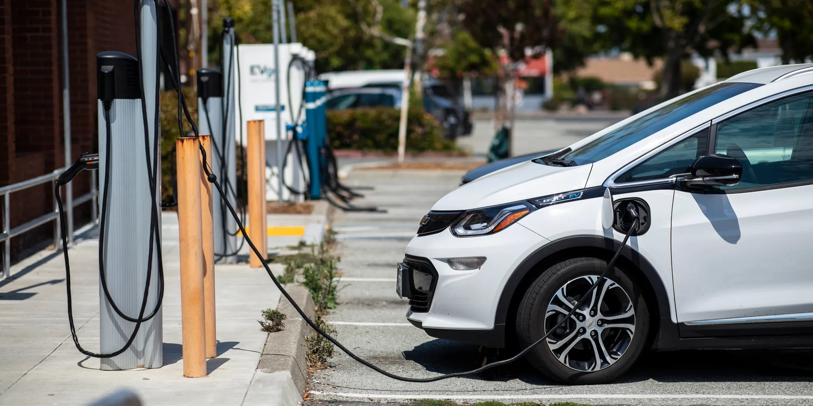

# Driving Clean: The Impact of Renewables, Income, and EVs on Air Quality and CO2 Emissions
 
<i>Photo by Martin do Nascimento, CalMatters, https://calmatters.org/environment/climate-change/2025/02/electric-car-sales-stall-california/</i>

 
<i>Smog in Jakarta, Indonesia, one of the most air polluted cities in the world. Photo by Wendra Ajistyatama, The Jakarta Post, https://www.thejakartapost.com/academia/2019/06/29/jakartas-enemy-is-air-pollution.html</i>

CO2 emissions and air quality present a huge problem in modern society, as it relates directly to global warming and people's health. This project aims to find if a country's renewable energy consumption, income level, and electric vehicle adoption affect its air quality and CO2 emissions. The answer to this question is explored through descriptive statistics by making various plots to see the relationship between each of our dependent variables and our independent variables, as well as building a linear regression model and looking at its R2. 

This project has found that a country’s use of renewable energy and income level has a small effect on its air quality and CO2 emissions. This project has also found that electric car sales share in each country has no correlation with its CO2 emissions and a slight negative relationship with its AQI.
